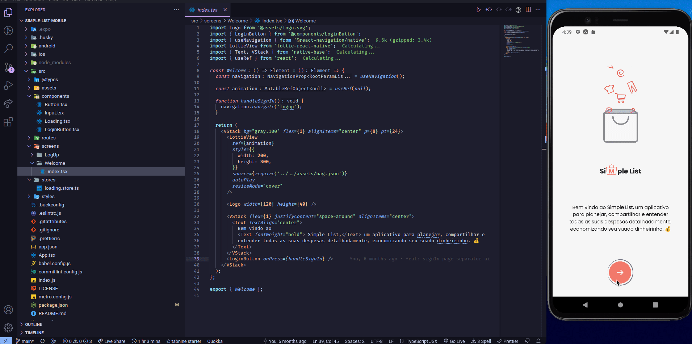

# Recriando Interface para fins de estudo
## Instalação

Instale o projeto com npm ou yarn 

```bash
  npm install ou yarn install
  cd simple-list-mobile
  yarn start
```


    
## Demonstração

<div align="center">

</div>  

